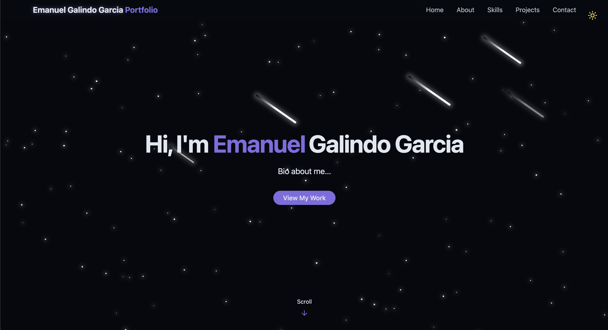

# My Portfolio Website with react and TailwindCSS

## 📋 Table of Contents

1. [Introduction](#-introduction)
2. [Tech Stack](#-tech-stack)
3. [Features](#-features)
4. [Quick Start](#-quick-start)
5. [Screenshots](#-screenshots)
6. [Deployment](#-deployment)

---

## 🚀 Introduction

In this project, I built a modern portfolio website using **React**, **TailwindCSS**, **Vite**, and **Lucide Icons**. From dark mode support to responsive animations and deployable project showcases, this project was mostly for me to learn react and frontend skills.

---

## ⚙️ Tech Stack

* **React** – Component-based UI development
* **Vite** – Lightning-fast build tool
* **TailwindCSS** – Utility-first CSS for styling
* **Lucide Icons** – Clean and beautiful icon pack
* **Radix UI** – Accessible component primitives
* **GitHub & Vercel** – Deployment

---

## ⚡️ Features

* 🌑 **Light/Dark Mode Toggle**
  Save theme preference in local storage with beautiful transitions

* 💫 **Animated Backgrounds**
  Stars, meteors, scroll effects, and glowing UI elements

* 📱 **Responsive Navigation**
  Desktop and mobile menus with glassmorphism

* 👨‍💻 **Hero & About Sections**
  Showcase who you are with smooth intro animations and buttons

* 📊 **Skills Grid**
  Filterable progress bars and categories with animated width

* 🖼️ **Projects Showcase**
  Display screenshots, tech stacks, and GitHub/demo links

* 📩 **Contact Section**
  Social icons + responsive contact form with toast notifications

* 🚀 **One-Click Deployment**
  Easily host your site with Vercel and GitHub
